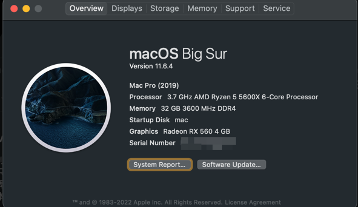

# Hackintosh-Opencore-MAG-MSI--B550M-MORTAR & 5600X & BCM94352Z DW1560

微星(MSI)MAG B550M MORTAR 迫击炮 & 5600X & BCM94352Z DW1560



**OpenCore : 0.7.6**

**macOS ：11.5.2**

**SMBIOS : MacPro7,1**

### Specification

| **Component** | **Model**                 |
| ------------------- |---------------------------|
| CPU                 | AMD R5 5600X              |
| Motherboard         | MSI(MAG) B550M MORTAR |
| RAM                 | DDR4 3600HZ  16G*2        |
| Audio Chipset       | ALCS1200A                 |
| GPU                 | RX 560 4G                 |
| Ethernet            | RTL8125B 2.5GbE           |
| WiFi & Bluetooth    | BCM94352Z  DW1560         |
| OS Disk(nvme)       | SN850 512G                |

### What works

- Audio

  [AppleALC](https://github.com/acidanthera/AppleALC) ( `alcid=11 `)
- Ethernet

  [LucyRTL8125Ethernet](https://github.com/Mieze/LucyRTL8125Ethernet)
- USB
- Wi-Fi

  AirportBrcmFixup.kext（ https://github.com/acidanthera/AirportBrcmFixup ）
  BrcmBluetoothInjector.kext（https://github.com/acidanthera/BrcmPatchRAM ）
  BrcmFirmwareData.kext
  BrcmPatchRAM3.kext
-### NEW AMD Kernel Patches

1. Enable `ProvideCurrentCpuInfo`

   `Kernel -> Quirks -> ProvideCurrentCpuInfo`
2. Edit the core count patch to match your CPU

   [AMD Vanilla OpenCore o](https://github.com/AMD-OSX/AMD_Vanilla/tree/master)r [OpenCore-Install-Guide](https://dortania.github.io/OpenCore-Install-Guide/extras/monterey.html#amd-patches)

   > Find the three `algrey - Force cpuid_cores_per_package`
   >
   > - `kernel -> Patch -> 0  -> Replace` for macOS 10.13,10.14
   > - `kernel -> Patch -> 1  -> Replace` for macOS 10.15,11.0
   > - `kernel -> Patch -> 2  -> Replace` for macOS 12.0
   >
   > ```
   > B8000000 0000 => B8 <core count> 0000 0000
   > BA000000 0000 => BA <core count> 0000 0000
   > BA000000 0090 => BA <core count> 0000 0090
   > ```
   >
   > | CoreCount | Hexadecimal |
   > | --------- | ----------- |
   > | 6 Core    | 06          |
   > | 8 Core    | 08          |
   > | 12 Core   | 0C          |
   > | 16 Core   | 10          |
   > | 32 Core   | 20          |
   > | 64 Core   | 40          |
   >
   > for eamlple : 3700X 8 Core
   >
   > ```
   > B8 08 0000 0000
   > BA 08 0000 0000
   > BA 08 0000 0090
   > ```
   >

please use [OpenCore Configurator](https://mackie100projects.altervista.org/opencore-configurator/) or  [OC Auxiliary](https://github.com/ic005k/QtOpenCoreConfig)  or  [GenSMBIOS](https://github.com/corpnewt/GenSMBIOS)  to generate yourself SMBIOS

